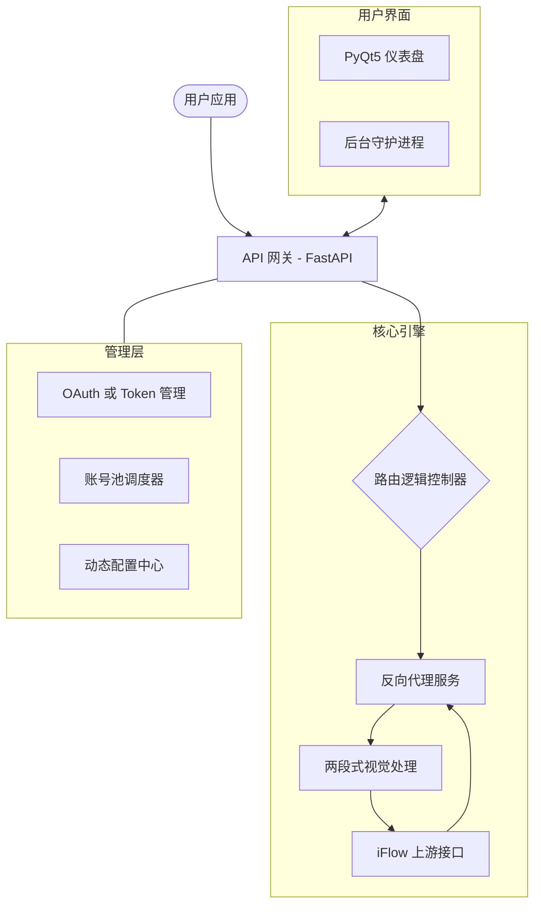

<p align="center">
  
</p>

<h1 align="center">🚀 iFlow2API</h1>

<p align="center">
  <strong>强大的 iFlow Python 反向代理解决方案</strong><br>
  <em>提供 OpenAI & Anthropic 兼容接口 • 极简 GUI 控制台 • 轻量化后台 Agent</em>
</p>

<p align="center">
  <a href="https://github.com/rtiy1/iflow2api/blob/main/README.md">English</a> | <strong>简体中文</strong>
</p>

<p align="center">
  <a href="https://github.com/rtiy1/iflow2api"></a>
  <a href="https://github.com/rtiy1/iflow2api"></a>
  <a href="https://github.com/rtiy1/iflow2api/blob/main/LICENSE"></a>
  
</p>

---

## 🌟 项目简介

**iFlow2API** 是一个高质量的 Python 反向代理工具，旨在将 iFlow 的非标准接口转换为完全兼容 **OpenAI** 和 **Anthropic** 标准的 API。项目内置了现代化的 PyQt5 仪表盘，让管理与监控变得前所未有的简单。

### ✨ 核心特性

| 功能模块 | 亮点介绍 |
| :--- | :--- |
| **🔌 全能兼容** | 完美支持 `/v1/chat/completions` 与 `/v1/messages` 标准接口。 |
| **👁️ 智能视觉** | 针对 `glm*` 和 `minimax*` 系列提供独有的智能两段式视觉路由逻辑。 |
| **🖥️ GUI 控制台** | 实时查看请求日志、管理模型列表与账号池，界面优雅直观。 |
| **🤖 后台 Agent** | 支持无界面常驻运行，集成 Windows 系统托盘与开机自启。 |
| **📦 动态发现** | 自动发现上游模型并补充本地优化模型，确保列表始终保持最新。 |

---

## 🏗️ 技术架构



---

## 🚀 快速开始

### 1. 环境准备

```bash
# 克隆仓库
git clone https://github.com/rtiy1/iflow2api.git
cd iflow2api

# 安装必要依赖
pip install -r requirements.txt
```

### 2. 认证配置 (推荐 OAuth)

使用内置命令行工具快速完成授权：
```bash
python iflow_auth_cli.py
```

### 3. 运行项目

根据您的使用习惯选择启动方式：

| 运行模式 | 启动命令 | 适用场景 |
| :--- | :--- | :--- |
| **图形界面** | `python gui_pyqt.py` | 桌面用户，需要可视化日志与控制。 |
| **标准服务端** | `python main.py` | 适合在服务器环境运行，仅保留 API。 |
| **后台模式** | `python iflow_agent.py start` | 无界面静默运行。 |

---

## ⚙️ 关键配置

配置文件通常位于 `~/.iflow/settings.json` 或 `oauth_creds.json`。

| 参数名 | 默认值 | 功能说明 |
| :--- | :--- | :--- |
| `base_url` | - | 上游 iFlow 接口地址。 |
| `api_key` | - | 您的访问令牌。 |
| `vision_model` | `qwen3-vl-plus` | 用于视觉处理阶段的模型。 |
| `auto_vision_model` | `true` | 是否对兼容模型自动开启两段式逻辑。 |
| `allow_local_images`| `false` | 是否允许处理本地文件路径的图片。 |

---

## 🧪 接口调用示例

### OpenAI 兼容格式 (对话)
```bash
curl http://127.0.0.1:8000/v1/chat/completions \
  -H "Content-Type: application/json" \
  -d '{
    "model": "glm-4.7",
    "messages": [{"role": "user", "content": "量子纠缠是什么？"}]
  }'
```

### Anthropic 兼容格式 (消息)
```bash
curl http://127.0.0.1:8000/v1/messages \
  -H "Content-Type: application/json" \
  -d '{
    "model": "glm-4.7",
    "max_tokens": 1024,
    "messages": [{"role": "user", "content": "你好！"}]
  }'
```

---

## 🛠️ 构建与发布

项目使用 **GitHub Actions** 自动完成 EXE 构建。如需本地手动构建：

```bash
python build_gui.py     # 构建 GUI 客户端
python build_agent.py   # 构建后台 Agent 客户端
```
*构建后的文件将输出到 `dist/` 目录。*

---

## 📄 开源协议

- 本项目采用 **MIT License**。
- 由 [rtiy1](https://github.com/rtiy1) 开发。
- 特别鸣谢 **FastAPI**, **PyQt5** 等优秀开源社区。

<p align="center">
  <a href="https://github.com/rtiy1/iflow2api/stargazers"></a>
  <a href="https://github.com/rtiy1/iflow2api/network/members"></a>
</p>
